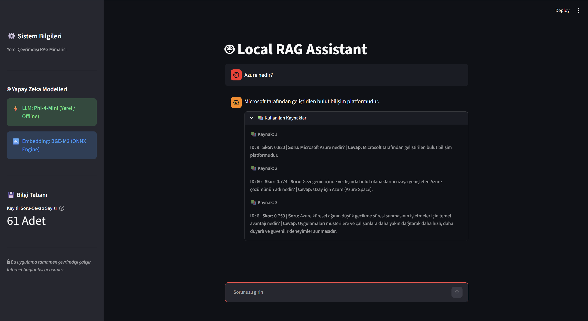

# Local RAG Assistant

> Yerel (offline) çalışan, Retrieval-Augmented Generation (RAG) mimarisi kullanılarak geliştirilmiş soru-cevap sistemi.

<p align="center">
  
</p>

Bu proje, kullanıcı tarafından sorulan sorulara yerel bir bilgi tabanını kullanarak cevap üreten bir **Retrieval-Augmented Generation (RAG)** uygulamasıdır.

Sistem; kullanıcı sorusunu embedding'e dönüştürür, SQLite veritabanındaki en ilgili dökümanları cosine similarity yöntemiyle bulur ve elde edilen bağlamı (context) kullanarak **Phi-4 Mini** modeli ile cevap üretir.

Model çıkarımı tamamen yerel ortamda gerçekleştirilir. Cevap üretimi sırasında internet bağlantısına ihtiyaç duyulmaz.

---

## Proje Mimarisi

Sistemin çalışma akışı aşağıdaki gibidir.

```
Kullanıcı Sorusu
        │
        ▼
BGE-M3 Embedding Modeli
        │
        ▼
Cosine Similarity
        │
        ▼
SQLite Bilgi Tabanı
        │
        ▼
En Benzer Dökümanlar
        │
        ▼
Prompt Oluşturma
        │
        ▼
Phi-4 Mini
        │
        ▼
Cevap
```

---

## Özellikler

- Yerel (Offline) RAG mimarisi
- BGE-M3 embedding modeli
- ONNX Runtime ile embedding üretimi
- SQLite tabanlı bilgi tabanı
- Cosine Similarity ile semantik arama
- Phi-4 Mini ile cevap üretimi
- Streamlit tabanlı kullanıcı arayüzü
- Kaynak döküman gösterimi
- Sohbet geçmişi desteği

---

## Proje Yapısı

```
LocalRAG/
│
├── app.py
├── main.py
│
├── data/
│   └── azure_questions.json
│
├── database/
│   └── rag.db
│
├── models/
│   └── bge-m3/
│
├── src/
│   ├── config.py
│   ├── database.py
│   ├── embeddings.py
│   ├── generator.py
│   ├── ingest.py
│   └── retrieval.py
│
├── rag.db
├── requirements.txt
└── README.md
```

---

## Kullanılan Teknolojiler

| Teknoloji | Amaç |
|-----------|------|
| Python | Uygulama geliştirme |
| Streamlit | Kullanıcı arayüzü |
| SQLite | Bilgi tabanı |
| ONNX Runtime | Embedding modeli |
| Transformers | Tokenizer |
| NumPy | Vektör işlemleri |
| Scikit-Learn | Cosine Similarity |
| BGE-M3 | Embedding modeli |
| Phi-4 Mini | Yerel LLM |
| Microsoft Foundry Local | Model çalıştırma |

---

## Çalışma Prensibi

1. Kullanıcı sisteme bir soru gönderir.
2. Soru, **BGE-M3** modeli kullanılarak embedding'e dönüştürülür.
3. Oluşturulan embedding ile veritabanındaki tüm embedding'ler karşılaştırılır.
4. Cosine similarity skoru belirlenen eşik değerin üzerinde olan kayıtlar filtrelenir.
5. En yüksek benzerlik skoruna sahip kayıtlar seçilir.
6. Seçilen kayıtlar prompt içerisine context olarak eklenir.
7. Prompt, Phi-4 Mini modeline gönderilir.
8. Üretilen cevap ve kullanılan kaynaklar kullanıcıya gösterilir.

---

# Gereksinimler

Projeyi çalıştırmadan önce aşağıdaki bileşenlerin kurulu olması gerekir.

- Python 3.10 veya üzeri
- Microsoft Foundry Local
- Phi-4 Mini modeli
- BGE-M3 embedding modeli (ONNX)

> **Not:** BGE-M3 modeli yüksek boyutlu olduğu için GitHub deposunda bulunmamaktadır. Modeli ayrıca indirerek `models/bge-m3/` klasörüne yerleştirmeniz gerekmektedir.

---

## Kurulum

### 1. Projeyi klonlayın.

```bash
git clone https://github.com/caglasskn/Local-RAG-Assistant.git
```

### 2. Proje klasörüne girin.

```bash
cd LocalRAG
```

### 3. Gerekli Python paketlerini yükleyin.

```bash
pip install -r requirements.txt
```

### 4. Microsoft Foundry Local servisini başlatın.

Phi-4 Mini modelinin çalışır durumda olduğundan emin olun.

### 5. `BASE_URL` değerini güncelleyin.

Microsoft Foundry Local her çalıştırıldığında farklı bir port numarası kullanabilir.

Örneğin:

```text
http://127.0.0.1:59340/v1
```

Bu adresi `src/config.py` dosyasındaki aşağıdaki değişkene yazın.

```python
BASE_URL = "http://127.0.0.1:59340/v1"
```

### 6. Uygulamayı çalıştırın.

```bash
streamlit run app.py
```

---

## Yapılandırma

Sistem ayarları `src/config.py` dosyasından değiştirilebilir.

```python
DATABASE_NAME = "rag.db"

TOP_K = 3
SIMILARITY_THRESHOLD = 0.72

MODEL_NAME = "Phi-4-mini-instruct-cuda-gpu:5"
BASE_URL = "http://127.0.0.1:59340/v1"

TEMPERATURE = 0
```

---

## Kullanılan Veri Seti

Bilgi tabanı, Azure konularını içeren soru-cevap çiftlerinden oluşturulmuştur.

İlk çalıştırmada `ingest.py` dosyası kullanılarak tüm dökümanlar embedding'e dönüştürülür ve SQLite veritabanına kaydedilir.

> **Not:** Projede örnek olarak oluşturulmuş `rag.db` dosyası hazır şekilde paylaşılmıştır. Böylece uygulama doğrudan çalıştırılabilir. Veritabanını yeniden oluşturmak isteyen kullanıcılar `ingest_data()` fonksiyonunu etkinleştirerek `python src/main.py` komutunu çalıştırabilir.

---

## Geliştirilebilecek Özellikler

- PDF ve Word döküman desteği
- Hybrid Search (BM25 + Embedding)
- Reranking
- Streaming cevap üretimi
- Docker desteği
- Çoklu bilgi tabanı desteği
